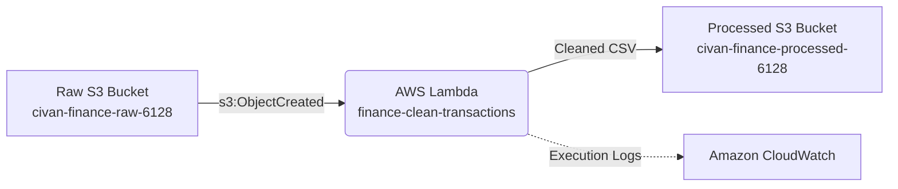

# AWS Serverless Finance Data Pipeline

An automated, event-driven data pipeline deployed on AWS that ingests, cleans, validates, and standardizes transaction data using S3 and Lambda.



## Architecture & Data Flow

1. **Ingestion**: Raw transaction CSVs are uploaded to `civan-finance-raw-6128`.
2. **Event Trigger**: S3 issues an `s3:ObjectCreated:*` notification filtered to `.csv` keys.
3. **Validation & Cleaning**:
   - Skips malformed rows or missing required fields (`date`, `amount`).
   - Normalizes whitespace and lowers category labels.
   - Categorizes records into `income` (`amount > 0`) or `expense` (`amount < 0`).
   - Removes duplicate records and sorts chronologically.
4. **Storage**: Standardized output is written to `civan-finance-processed-6128` under `*_cleaned.csv`.

## Security & Governance

- **Least Privilege**: IAM role grants only `s3:GetObject` on the raw bucket and `s3:PutObject` on the processed bucket.
- **S3 Block Public Access**: Configured with strict public ACL and policy blocks on all storage endpoints.
- **Dependency Isolation**: Uses standard-library Python runtime to keep deployment packages small and deterministic.

## Local Development & Testing

```bash
# 1. Run local unit test
python tests/test_clean_locally.py

# 2. Package Lambda artifact
cd lambda && zip -r ../finance-clean-transactions.zip handler.py && cd ..
```
